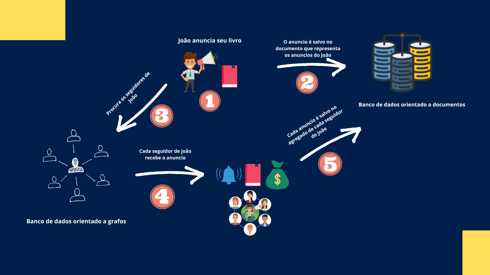
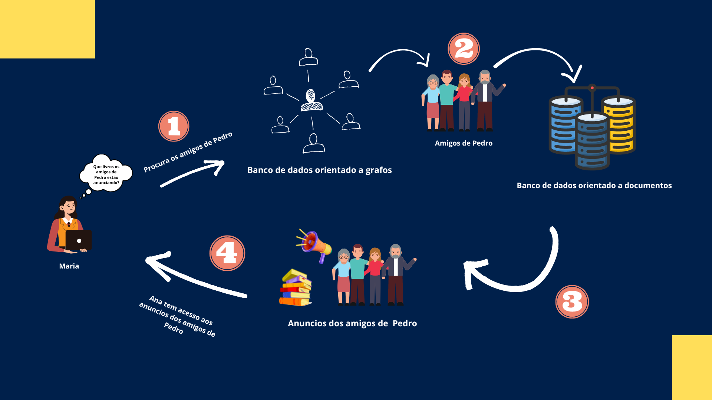

# Protótipo de uma aplicação com persistência poliglota + Apache Spark

## Descrição
    Projeto realizado durante a edição da disciplina de processamento massivo de dados, o desafios propostos para o projeto foram:
    - Escolha de um tema para a aplicação.
    - Escolha das fontes de dados a serem utilizadas.
    - Escolha de dois bancos de dados NoSQL para armazenamento dos dados.
    - Utilizar o PySpark no processo de ETL dos dados.
    - Recuperar através de consultas os dados dos bancos de dados escolhidos anteriormente.

## Escolha do tema
    O tema escolhido para a realização do projeto foi o de uma aplicação C2C de vendas de livros, na qual usuários podem anunciar livros para os seus amigos e também consultar anúncios de seus amigos. Os relacionamentos de amizade entre os usuários seriam representados como um grafo.

    
    

## Fontes de dados utilizadas
    Foram utilizadas duas fontes de dados obtidas do [Kaggle](https://www.kaggle.com/) para construir os dados artificiais da aplicação sendo eles:
    - [Age dataset: life, work, and death of 1.22M people](https://www.kaggle.com/datasets/imoore/age-dataset): utilizado nos dados dos usuários da aplicação. 
    - [Books Dataset](https://www.kaggle.com/datasets/saurabhbagchi/books-dataset): utilizado nos anúncios da aplicação.

## Bancos de dados NoSQL utilizados
    Utilizei dois bancos de dados NoSQL na aplicação sendo eles:
    - RavenDB: Orientado a documentos, permitiu armazenar as informações pessoais dos usuários, bem como o histórico de anúncios feitos e recebidos atrelados a eles.
    - Neo4J: Orientado a Grafos, permitiu armazenar os relacionamentos de amizade entre os usuários.

## PySpark para realizar o processo de ETL
    Utilizei o framework PySpark para realizar o processo de ETL (Extract Transform e Load) dos dados obtidos dos datasets obtidos do Kaggle.

## Outras tecnologias utilizadas
- Anaconda.
- Jupyter Notebook. 
- Visual Studio Code.
